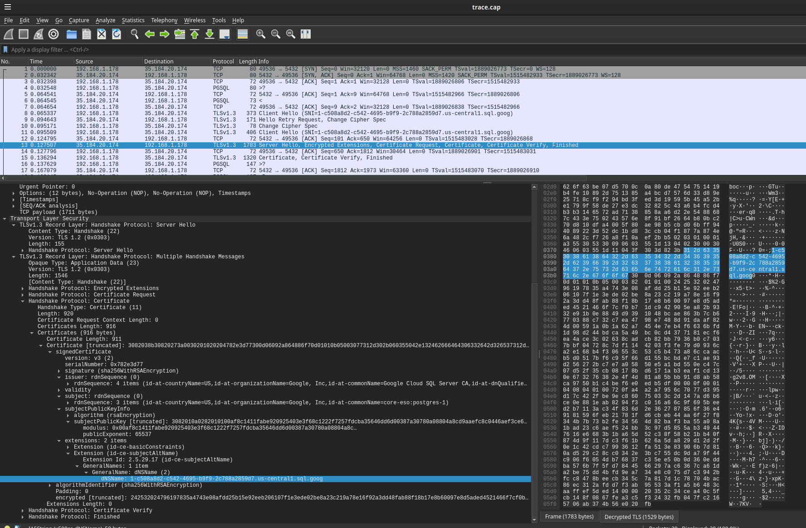

## Google Cloud SQL IAM and mTLS authentication with Trusted Platform Module

CloudSQL client where the GCP IAM service account credentials and mTLS client certificates are save inside a `Trusted Platform Module (TPM)`

- **IAM**

  [CloudSQL IAM Authentication](https://cloud.google.com/sql/docs/postgres/iam-authentication) for service accounts describes how to a cloud sql client connects to the service.

  If you are running on GCP, the solution is easy: just use the ambient service account credentials.  If you are on prem, you can use either service account json files or (preferably) workload federation.

  In the event you can't use workload federation, you have to resort to using service account json files which is really not recommended.  

  This repo shows how you can embed a service account credentials into a `Trusted Platform Module (TPM)`.  
 
  This is done using a custom  [oauth2.TpmTokenSource](https://github.com/salrashid123/oauth2?tab=readme-ov-file#usage-tpmtokensource)


- **mTLS**

  CloudSQL also allows you to connect using mTLS certificates: [CloudSQL Self-managed SSL/TLS certificates](https://cloud.google.com/sql/docs/postgres/connect-overview#ssl_tls)

  For this, you download the public/private keys issued by CloudSQL instance and use that at the client to connect to.

  Similar to IAM, the risk is having the private key as a file so this repo allows you to embed the private key into a `TPM` using a custom golang `crypto.Signer` implementation:

  - [crypto.Signer, implementations for Google Cloud KMS and Trusted Platform Modules](https://github.com/salrashid123/signer)
  - [mTLS with TPM bound private key](https://github.com/salrashid123/go_tpm_https_embed)


>> this is *not* supported by google

---

### Setup

FIrst create a cloud sql instance, enable mtls

```bash
export PROJECT_ID=`gcloud config get-value core/project`

gcloud sql instances create postgres-1 --database-version=POSTGRES_15  \
 --no-backup --require-ssl --root-password="iTi3KsuGtz" \
 --tier=db-g1-small --edition=enterprise --ssl-mode=TRUSTED_CLIENT_CERTIFICATE_REQUIRED \
 --region=us-central1 --availability-type=zonal

  # NAME        DATABASE_VERSION  LOCATION       TIER         PRIMARY_ADDRESS  PRIVATE_ADDRESS  STATUS
  # postgres-1  POSTGRES_15       us-central1-c  db-g1-small  23.236.59.4      -                RUNNABLE

export PRIMARY_ADDRESS=23.236.59.4

## configure IAM and a service account

gcloud iam service-accounts create pg-svc-account --display-name "Postgres Service Account"
export SERVICE_ACCOUNT_EMAIL=pg-svc-account@$PROJECT_ID.iam.gserviceaccount.com
gcloud iam service-accounts keys create pg_svc_account.json --iam-account=$SERVICE_ACCOUNT_EMAIL 

gcloud sql databases create testdb --instance=postgres-1
gcloud sql instances patch postgres-1 --database-flags=cloudsql.iam_authentication=on
gcloud projects add-iam-policy-binding $PROJECT_ID --member="serviceAccount:$SERVICE_ACCOUNT_EMAIL" --role="roles/cloudsql.client"
gcloud sql users create pg-svc-account@$PROJECT_ID.iam --instance=postgres-1 --type=cloud_iam_service_account
gcloud projects add-iam-policy-binding $PROJECT_ID   --member="serviceAccount:$SERVICE_ACCOUNT_EMAIL"   --role=roles/cloudsql.instanceUser

gcloud sql instances describe postgres-1 --format='get(serverCaCert.cert)' > server-ca.pem
gcloud sql ssl client-certs create client  client-key.pem --instance=postgres-1
gcloud sql ssl client-certs describe client --instance=postgres-1 --format="value(cert)" > client-cert.pem
```


We are going to use a GCP VM with a TPM to test (so as not to messup your lapotp)

Configure a VM on GCP with a TPM (optional)

```bash
gcloud compute  instances create   ts-client \
       --zone=us-central1-a --machine-type=e2-medium \
       --tags tpm  \
       --no-service-account  --no-scopes \
       --shielded-secure-boot --shielded-vtpm \
       --shielded-integrity-monitoring \
       --image-family=debian-11 --image-project=debian-cloud
export EXTERNAL_IP=`gcloud compute instances describe ts-client  --zone=us-central1-a  --format='get(networkInterfaces[0].accessConfigs.natIP)'`

## allow connectivity from the VM and your laptop
export MY_IP=`dig +short myip.opendns.com @resolver1.opendns.com`

gcloud sql instances patch postgres-1 --authorized-networks=$MY_IP/32,$EXTERNAL_IP/32
```

now ssh to the instance:

```bash
sudo su -

## install latest tpm2-tools:
####  https://github.com/salrashid123/tpm2/tree/master?tab=readme-ov-file#installing-tpm2_tools-golang

apt-get update

apt -y install   autoconf-archive   libcmocka0   libcmocka-dev   procps  \
   iproute2   build-essential   git   pkg-config   gcc   libtool   automake \
     libssl-dev   uthash-dev   autoconf   doxygen  libcurl4-openssl-dev dbus-x11 libglib2.0-dev libjson-c-dev acl

cd
git clone https://github.com/tpm2-software/tpm2-tss.git
  cd tpm2-tss
  ./bootstrap
  ./configure --with-udevrulesdir=/etc/udev/rules.d
  make -j$(nproc)
  make install
  udevadm control --reload-rules && sudo udevadm trigger
  ldconfig

cd
git clone https://github.com/tpm2-software/tpm2-tools.git
  cd tpm2-tools
  ./bootstrap
  ./configure
  make check
  make install


## install golang  
wget https://go.dev/dl/go1.22.3.linux-amd64.tar.gz
rm -rf /usr/local/go && tar -C /usr/local -xzf go1.22.3.linux-amd64.tar.gz
export PATH=$PATH:/usr/local/go/bin
```

### Test laptop to cloudsql mtls connection

To test directly from you laptop (assuming you setup the `authorized-networks=`),

```bash
PGPASSWORD=iTi3KsuGtz \
 psql "sslmode=verify-ca sslrootcert=server-ca.pem \
  sslcert=client-cert.pem sslkey=client-key.pem hostaddr=$PRIMARY_ADDRESS \
   port=5432 user=postgres dbname=postgres"
```

to test connectivity using openssl, remember to set `-starttls postgres`:

```bash
openssl s_client  -connect $PRIMARY_ADDRESS:5432  \
            -starttls postgres \
            -CAfile server-ca.pem  \
            -cert client-cert.pem  \
            -key client-key.pem   -tls1_3 
```

### mTLS

We now need to embed the tls private key into the device

```bash
gcloud compute scp client-cert.pem ts-client:/tmp/
gcloud compute scp server-ca.pem ts-client:/tmp/
gcloud compute scp client-key.pem ts-client:/tmp/
```

on `ts-client`:

```bash
tpm2_createprimary -C o -g sha256 -G rsa -c primary.ctx
tpm2_import -C primary.ctx -G rsa2048:rsapss:null -g sha256  -i client-key.pem -u key.pub -r key.prv
tpm2_load -C primary.ctx -u key.pub -r key.prv -c key.ctx
tpm2_evictcontrol -C o -c key.ctx 0x81010003    
```

Now, gcp server certificate has an unusual SNI value so we need to coax that out first

```bash
go run main.go --cacert /tmp/server-ca.pem --host=23.236.59.4 \
   --persistentHandle=0x81010003 --publicCert /tmp/client-cert.pem \
   --password="iTi3KsuGtz" --sni=foo

## you'll see an error like this:
2024/05/19 14:04:55 cloudsqlconn.ping: failed to connect to 
`host=23.236.59.4 user=postgres database=postgres`:
 failed to write startup message (write failed: tls: 
 failed to verify certificate: x509: certificate is valid 
    for 1-31a79e39-efbe-4f6d-bb92-eb57f42f544e.us-central1.sql.goog, not foo)

## so specify the SNI value and rerun
go run main.go --cacert /tmp/server-ca.pem --host=23.236.59.4 \
   --persistentHandle=0x81010003 --publicCert /tmp/client-cert.pem \
   --password="iTi3KsuGtz" --sni="1-31a79e39-efbe-4f6d-bb92-eb57f42f544e.us-central1.sql.goog"

2024/05/19 14:06:41 Done
```

done!..you've now connected to the server using mtls


### IAM

First test IAM access using the service account credentials directly

```bash
gcloud auth activate-service-account --key-file=/path/to/pg_svc_account.json
export TOKEN=`gcloud auth print-access-token`

PGPASSWORD=$TOKEN psql "sslmode=require hostaddr=$PRIMARY_ADDRESS  port=5432 user=pg-svc-account@$PROJECT_ID.iam dbname=postgres"
```

Now that we've connected successfully, we need to extract the extra

```bash
cat pg_svc_account.json | jq -r '.private_key' > /tmp/f.json
openssl rsa -out /tmp/key_rsa.pem -traditional -in /tmp/f.json
openssl rsa -in /tmp/key_rsa.pem -outform PEM -pubout -out public.pem

gcloud compute scp /tmp/key_rsa.pem ts-client:/tmp/
```

then on `ts-client`

```bash
tpm2_createprimary -C o -g sha256 -G rsa -c primary.ctx
tpm2_import -C primary.ctx -G rsa2048:rsassa:null -g sha256  -i /tmp/key_rsa.pem -u key.pub -r key.prv
tpm2_load -C primary.ctx -u key.pub -r key.prv -c key.ctx
tpm2_evictcontrol -C o -c key.ctx 0x81010002
```

```bash
go run main.go --persistentHandle="0x81010002" \
 --serviceAccountEmail="pg-svc-account@core-eso.iam.gserviceaccount.com" \
  --instanceConnectionName="core-eso:us-central1:postgres-1"  --user="pg-svc-account@core-eso.iam"

2024/05/19 14:38:28 Done
```

If you enables ssl trace logs and tcpdump, you can inspect the tls certificate specifications with wirshark



---

### Appendix

##### Envoy with CloudSQL PRoxy

Completely unrelated to TPM based access to CloudSQL, you can also connect via envoy for both mTLS and IAM though for IAM, the access_token will not get refreshed (meaning, its not that useful)

To connect via envoy, see [Envoy Postgres Proxy Filter with TLS](https://github.com/salrashid123/envoy_postgres), a sample envoy cluster config could reade

```yaml
  clusters:
  - name: postgres_cluster
    connect_timeout: 1s
    type: strict_dns
    load_assignment:
      cluster_name: postgres_cluster
      endpoints:
      - lb_endpoints:
        - endpoint:
            address:
              socket_address:
                address: 23.236.59.4
                port_value: 5432
    transport_socket:
      name: envoy.transport_sockets.starttls
      typed_config:
        "@type": type.googleapis.com/envoy.extensions.transport_sockets.starttls.v3.UpstreamStartTlsConfig
        cleartext_socket_config: {}
        tls_socket_config:
          allow_renegotiation: true
          sni: "1-31a79e39-efbe-4f6d-bb92-eb57f42f544e.us-central1.sql.goog"
          common_tls_context:
            validation_context:
              match_typed_subject_alt_names:
              - san_type: DNS
                matcher:
                  exact: "1-31a79e39-efbe-4f6d-bb92-eb57f42f544e.us-central1.sql.goog"
              trusted_ca:
                filename: "server-ca.pem"
            tls_certificates:
            - certificate_chain:
                filename: client-cert.pem
              private_key:
                filename: client-key.pem
```

and replace the upstream settings for CloudSQL.   FOr the client, remember to set `channel_binding=disable`

as in

```bash
psql "sslmode=verify-ca \
 sslrootcert=root-ca.crt \
  sslcert=alice.crt sslkey=alice.key \
   hostaddr=127.0.0.1 port=5432 user=postgres dbname=postgres channel_binding=disable"
 ```
